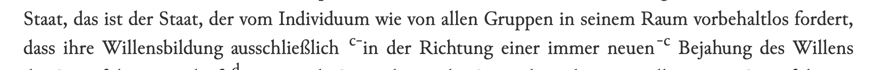

# Anmerkungen (Fussnoten)

Anmerkungen/Fussnoten werden mit `<note>` in den Text eingefügt.

Es werden folgende Typen unterschieden:

- Sachanmerkungen der Herausgeber: `<note>` (arabische Ziffern)
- Textkritische Anmerkungen: `<note type="textcritical">`
- Originalfussnoten: `<note type="original">`
- Anmerkungen der digitalen Ausgabe: `<note type="digital">`

<!-- Fussnoten: @place entfernen-->

Wenn `@n` angegeben wird, wird der Wert für die Kennzeichnung der Fußnote im Haupttext sowie in der Fußnotenzählung verwendet. Dies ist insbesondere für "*"-Fussnoten von Bedeutung.

Jede Fußnote erhält eine `@xml:id`, damit sie verlinkt werden kann. Die Standard-Kennzeichnung der Fußnoten sollte sein.

## Sachanmerkungen

Die xml:id hat ein führendes "n" und eine mindestens zweistellige Ziffer

`<note xml:id="n01">...</note>`

## Textkritische Anmerkungen

```
<note type="textcritical" xml:id="na">Korrigiert aus: „seiner“.</note>
```

### Verweis auf Vorlagen
In den textkritischen Anmerkungen wird häufig auf Vorlagen verwiesen:

```xml
<note n="g" type="textcritical" xml:id="ng"> 
<ref corresp="B">Mskr.</ref>: „Nachschreiben in menschlicher Sprache“ 
(die nicht in das <ref corresp="A">Tskr.</ref> übernommenen Worte sind im 
<ref corresp="B">Mskr.</ref>...
```

Die Vorlagen sind im `<teiHeader>` in `<srcDesc>` aufgelistet und enthalten eine entsprechende `@xml:id`. Die Vorlagen sind in der Datenbank mit den Texten verknüpft.

!!! note "Datenbank oder `kb_latest_version` für `xml:id`"
    Der `<teiHeader>` wird aus der Datenbank erzeugt. Für die Feststellung der korrekten `@xml:id` ist also die Datenbank oder die `kb_latest_version` zu konsultieren.

### Textkritische Fußnoten mit von-bis Kennzeichnung

Hier wird der Anfang des in der Fußnote kommentierten Bereichs mit `<anchor type="note" xml-id="..." />` und das Ende mit `<note target="...">` gekennzeichnet. Der Text der Fußnote steht immer innerhalb der `<note>`. Die Nummer der Fußnote wird aus dem Wert in `@n` genommen. Die `@xml:id` für `<anchor>` und der Eintrag in `target` müssen identisch sein. 



```xml
dass ihre Willensbildung ausschließlich 
<anchor type="note" xml:id="fn-c"/>in der Richtung einer immer 
neuen<note n="c" target="fn-c" type="textcritical" xml:id="nc"> 
Korrigiert aus: „zu immer neuer“.</note>
```
### Textkritik in Sachanmerkungen
Bei manchen Texten gibt es so wenig Textkritik, dass diese in den Sachanmerkungen untergebracht wurden (um keinen zweiten Apparat im Druck zu benötigen):

```xml
<!-- Sachanmerkung note ohne @type-->
<note xml:id="n01">Im <ref corresp="A">Mskr.</ref> Mittelteil durch Lochung
 unleserlich.</note>
```

## Originalfussnoten

### Sternchen-Fussnoten

```xml
<note n="*" type="original">...</note>
```

Bei einfachen Sternchenfussnoten ist in der Regel keine `@xml:id` nötig.

### Mehrere Sternchen-Fussnoten

Sie sind im Text mit einem * gekennzeichnet, da wir kein * in der `@xml:id` verwenden können, ist dieses durch ein "_s" gekennzeichnet. 

Beispiel: Die 7. Sterchen-Fussnote in einem Text:
```xml
<note n="*7" type="original" xml:id="n_s7"> ...</note>
```

## Digitale Anmerkungen

Digitale Anmerkungen kommen nur in der digitalen Edition vor und enthalten einen zusätzlichen Kommentar oder eine Korrektur des Textes der gedruckten Textausgabe.

## Abweichungen von Standard-Kennzeichnungen
 
### Doppelt verwendete Fussnotenzeichen

Es kommt vor, dass im Buch innerhalb eines Textes identische Fußnoten doppelt verwendet werden. Eine `@xml:id` muss innerhalb einer Datei eindeutig sein.
 
Hier Vorschläge, um sie in der digitalen Version zu unterscheiden:

- eine doppelte Sachfußnote `xml:id="n01"`
  ersetzen durch: 

`<note xml:id="n01a">` und `<note xml:id="n01b">` 

- eine doppelte textkritische Fußnote `xml:id="na"`
  ersetzen durch: 

`xml:id="na1"` und `xml:id="na2"`

Sie erscheinen im Browser entsprechend der Änderung dann mit "1a" und "1b"  bzw. "a1" bzw. "a2".
  
