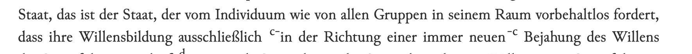

# Anmerkungen (Fussnoten)

Anmerkungen/Fussnoten werden mit `<note>` in den Text eingefügt.

Innerhalb der Anmerkungen wird grundsätzlich **zurückhaltender getaggt**
als im Haupttext. Namen, Orte und Datumsangaben werden nur getaggt, wenn
sie im Sinnhorizont des Haupttextes stehen — wenn also der Schreibende an
das, was in der Anmerkung steht, gedacht haben kann.

Es werden folgende Typen unterschieden:

- Sachanmerkungen der Herausgeber: `<note>` (arabische Ziffern)
- Textkritische Anmerkungen: `<note type="textcritical">`
- Originalfussnoten: `<note type="original">`
- Anmerkungen der digitalen Ausgabe: `<note type="digital">`

Wenn `@n` angegeben wird, wird der Wert für die Kennzeichnung der Fußnote
im Haupttext sowie in der Fußnotenzählung verwendet. Dies ist insbesondere
für "*"-Fussnoten von Bedeutung.

Jede Fußnote erhält eine `@xml:id`, damit sie verlinkt werden kann.

## Sachanmerkungen

Die xml:id hat ein führendes "n" und eine mindestens zweistellige Ziffer

`<note xml:id="n01">...</note>`

## Textkritische Anmerkungen

```
<note type="textcritical" xml:id="na">Korrigiert aus: „seiner“.</note>
```

### Verweis auf Vorlagen
In den textkritischen Anmerkungen wird häufig auf Vorlagen verwiesen:

```xml
<note n="g" type="textcritical" xml:id="ng"> 
<ref corresp="B">Mskr.</ref>: „Nachschreiben in menschlicher Sprache“ 
(die nicht in das <ref corresp="A">Tskr.</ref> übernommenen Worte sind im 
<ref corresp="B">Mskr.</ref>...
```

Die Vorlagen sind im `<teiHeader>` unter `sourceDesc` aufgelistet und
enthalten eine `@xml:id` (z.B. `"A"`, `"B"`). Im TEI-Text wird mit
`<ref corresp="B">Mskr.</ref>` auf die entsprechende Vorlage verwiesen:

```xml
<!-- teiHeader -->
<sourceDesc>
  <bibl xml:id="A" type="source">A (Vorlage der Edition): …</bibl>
  <bibl xml:id="B" type="source">B (Weitere Vorlage): …</bibl>
</sourceDesc>

<!-- textkritische Fussnote -->
<note type="textcritical" xml:id="ng">
  <ref corresp="B">Mskr.</ref>: „Nachschreiben in menschlicher Sprache"
  (die nicht in das <ref corresp="A">Tskr.</ref> übernommenen Worte …)
</note>
```

!!! note "Datenbank oder `kb_latest_version` für `xml:id`"
    Der `<teiHeader>` wird aus der Datenbank erzeugt. Für die Feststellung
    der korrekten `@xml:id` ist die Datenbank oder `kb_latest_version` zu
    konsultieren (in `kb_xml_src` ist die `@xml:id` manchmal noch nicht
    eingetragen).

### Textkritische Fußnoten mit von-bis Kennzeichnung

Hier wird der Anfang des in der Fußnote kommentierten Bereichs mit `<anchor type="note" xml-id="..." />` und das Ende mit `<note target="...">` gekennzeichnet. Der Text der Fußnote steht immer innerhalb der `<note>`. Die Nummer der Fußnote wird aus dem Wert in `@n` genommen. Die `@xml:id` für `<anchor>` und der Eintrag in `target` müssen identisch sein. 



```xml
dass ihre Willensbildung ausschließlich 
<anchor type="note" xml:id="fn-c"/>in der Richtung einer immer 
neuen<note n="c" target="fn-c" type="textcritical" xml:id="nc"> 
Korrigiert aus: „zu immer neuer“.</note>
```
### Textkritik in Sachanmerkungen
Bei manchen Texten gibt es so wenig Textkritik, dass diese in den Sachanmerkungen untergebracht wurden (um keinen zweiten Apparat im Druck zu benötigen):

```xml
<!-- Sachanmerkung note ohne @type-->
<note xml:id="n01">Im <ref corresp="A">Mskr.</ref> Mittelteil durch Lochung
 unleserlich.</note>
```

## Originalfussnoten

### Sternchen-Fussnoten

```xml
<note n="*" type="original">...</note>
```

Bei einfachen Sternchenfussnoten ist in der Regel keine `@xml:id` nötig.

### Mehrere Sternchen-Fussnoten

Sie sind im Text mit einem * gekennzeichnet, da wir kein * in der `@xml:id` verwenden können, ist dieses durch ein "_s" gekennzeichnet. 

Beispiel: Die 7. Sterchen-Fussnote in einem Text:
```xml
<note n="*7" type="original" xml:id="n_s7"> ...</note>
```

## Digitale Anmerkungen

Digitale Anmerkungen kommen nur in der digitalen Edition vor. Sie sind
äusserst sparsam einzusetzen und dienen zwei Zwecken:

- **Inhaltliche Korrektur**, bei der der Originaltext sichtbar bleiben soll.
  Beispiel: Der Autor schreibt "Gregor VI.", meint aber Gregor VII. — das
  ist kein blosser Druckfehler, sondern ein sachlicher Irrtum, der im
  Original erkennbar bleiben und in einer Fussnote kommentiert werden soll.
- **Nachträgliche Ergänzung**, z.B. ein Querverweis auf eine andere Stelle
  der Gesamtausgabe, der bei der Drucklegung noch nicht existierte.

Reine Druckfehler (Buchstabendreher, falsche Schreibung) werden dagegen
**nicht** mit digitalen Anmerkungen kommentiert, sondern stillschweigend
mit `<choice>/<sic>/<corr>` korrigiert — siehe
[Korrekturen der Druckausgabe](../textelemente/korrekturen-der-druckausgabe.md).

### Auszeichnung

Digitale Anmerkungen erhalten `@type="digital"`, `@resp` mit dem Kürzel der
verantwortlichen Person und `@n` für die korrekte Einordnung in den
Fussnotenapparat. Die `@xml:id` wird mit einem griechischen Buchstaben
gebildet, damit sie sich von den arabischen Ziffern (Sachanmerkungen) und
lateinischen Buchstaben (textkritische Anmerkungen) unterscheidet:

```xml
<note resp="ak" type="digital" xml:id="nα" n="α">Richtig: 
<persName ref="kbga-actors-4707">Gregor VII.</persName> 
(um <date from="1025" to="1085">1025–1085</date>)</note>
```

Digitale Anmerkungen können auch innerhalb einer bestehenden Fussnote stehen
(verschachtelte `<note>`):

```xml
<note xml:id="n02">Herkunft nicht nachweisbar.
  <note type="digital" resp="ak" xml:id="nα"> 
    <ref type="pub-" target="../volume/48/p586#fn_n94">1914-1921, 
    S. 586f., Anm. 94</ref>
  </note>
</note>
```

## Fussnoten für mehrere Textstellen (`<ptr>`)

Bezieht sich dieselbe Fussnote auf mehrere Textstellen, wird an der zweiten
Stelle ein `<ptr>` gesetzt, das auf die `@xml:id` der bestehenden Fussnote
verweist. Das Fussnotenzeichen wird dort erneut angezeigt und verlinkt auf
dieselbe Fussnote:

```xml
<note xml:id="n01"> Der angezeigte Text </note>
<!-- … an anderer Stelle im selben Text: -->
<ptr n="1" type="note" target="n01"/>
```

## Biogramme (`<seg type="bio">`, `<seg type="org">`)

Biogramme zu Personen und Organisationen stehen in Sachanmerkungen und
werden mit `<seg>` markiert. Innerhalb des `<seg>` muss mindestens die
Person bzw. Organisation mit `<persName>` / `<orgName>` und `@ref`
ausgezeichnet sein. Weitere Auszeichnungen innerhalb des Biogramms sind
nicht nötig (Pop-ups werden im Biogramm-Bereich unterdrückt).

```xml
<seg type="bio">
  <persName ref="kbga-actors-296">Friedrich Niebergall</persName> 
  (20.3.1866-20.9.1932), 1892 Pfarrer in Kirn, seit 1903 akademische
  Lehrtätigkeit als praktischer Theologe in Heidelberg, seit 1922 als
  Ordinarius in Marburg.
</seg>
```

Für Organisationen wird `<seg type="org">` verwendet:

```xml
<seg type="org">Die Zeitschrift 
  «<orgName ref="kbga-actors-6169">Zwischen den Zeiten</orgName>» 
  wurde 1912 gemeinsam von 
  <persName ref="kbga-actors-2151">Karl Barth</persName>, 
  <persName ref="kbga-actors-137">Friedrich Gogarten</persName>, 
  <persName ref="kbga-actors-403">Eduard Thurneysen</persName> und 
  <persName ref="kbga-actors-275">Georg Merz</persName> begründet.
</seg>
```

Zu `<persName>` und `<orgName>` allgemein siehe
[Textelemente → Akteure](../textelemente/akteure.md).

## Abweichungen von Standard-Kennzeichnungen
 
### Doppelt verwendete Fussnotenzeichen

Es kommt vor, dass im Buch innerhalb eines Textes identische Fußnoten
doppelt verwendet werden. Eine `@xml:id` muss innerhalb einer Datei
eindeutig sein. Doppelte Fussnotenzeichen werden wie folgt aufgelöst:

- eine doppelte Sachfußnote `xml:id="n01"`
  ersetzen durch: 

`<note xml:id="n01a">` und `<note xml:id="n01b">` 

- eine doppelte textkritische Fußnote `xml:id="na"`
  ersetzen durch: 

`xml:id="na1"` und `xml:id="na2"`

Sie erscheinen im Browser entsprechend der Änderung dann mit "1a" und "1b"  bzw. "a1" bzw. "a2".
  
